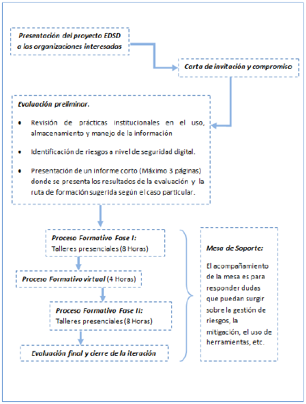

# Guía para la facilitación del proceso formativo

![]ESD_small.png)
 

# Bienvenida
Este recurso se ha creado en el marco del Proyecto de Escuela de Seguridad Digital para la  implementación del proceso de acompañamiento en Seguridad Digital dirigido a organizaciones de la sociedad civil, defensores de derechos humanos, activistas, comunidad LGBT, ambientalistas y periodistas, entre otras. Este proyecto es apoyado por eQualit.ie y coordinado por Colnodo. 

El objetivo de esta guía es orientar a los facilitadores y facilitadoras respecto al diseño estructural, los lineamientos metodológicos y el plan de contenidos propio del proceso formativo de alfabetización en Seguridad Digital. 

Inicialmente se presenta la ruta de acompañamiento diseñada para ofrecer a las organizaciones un proceso coherente, basado en un panorama de riesgos en el uso y manejo de la información digital que muestra la evaluación preliminar aplicada a cada una de las instituciones participantes. A partir de esta evaluación se seleccionan los módulos de formación más pertinentes para cada una de las organizaciones, los cuales se desarrollaran en 16 horas presenciales y 4 virtuales, para un total de 20 horas de capacitación y una mesa de soporte que acompaña de manera permanente el proceso. 

Seguidamente, este documento presenta cada uno de los módulos de capacitación y recomendaciones para la formación, con descripciones detalladas de las actividades a desarrollar las cuales están orientadas a promover habilidades y prácticas relevantes que puedan aplicarse dentro de las organizaciones y ayuden a mitigar las vulnerabilidades en cuanto al manejo de información física y digital. 

En suma, esta currícula tiene el propósito de promover en las personas participantes el uso de herramientas y buenas prácticas para el manejo seguro de la información, de modo que puedan aplicar estos aprendizajes en sus organizaciones y en su vida cotidiana, haciendo de la seguridad digital una práctica diaria para la protección de su privacidad y la de las personas a quienes impacta su trabajo.  

## Ciclo de vida del proceso de acompañamiento

 
     

# Acerca de la Currícula

Esta currícula ha sido diseñada para orientar el proceso formativo que realizaran los y las facilitadoras de la Escuela de Seguridad Digital – ESD de Colnodo. De igual manera puede apoyar la labor de facilitación de personas que quieran conducir capacitaciones sobre conceptos y herramientas de seguridad digital a distintos grupos u organizaciones, pero es importante tener en cuenta que el conjunto completo de sesiones no es relevante para todos los públicos, así que la recomendación es identificar los módulos más adecuados para cada organización teniendo en cuenta una ***evaluación prelimina***.

El proceso formativo de la ESD tiene una duración de 20 horas, de las cuales 16 son presenciales y 4 virtuales. Para la implementación de la fase presencial se han diseñado 8 módulos que abarcan diversas temáticas relacionadas con anonimato, privacidad, navegación segura, correo electrónico, celulares y redes sociales, algunas de ellas en niveles básico e intermedio. Es importante decir que durante las 16 horas presenciales solo se abordarán 4 de estos 8 módulos, por ello los resultados de la evaluación preliminar son claves para priorizar los temas a abordar con cada organización.

Para el desarrollo de la fase virtual la ESD cuenta con una plataforma de aprendizaje que ofrecerá igualmente 8 módulos de formación de una (1) hora de duración, correspondientes con las temáticas planteadas en la fase presencial. De esta manera, la propuesta es que los 4 módulos que se aborden en las sesiones presenciales se complementen con una serie de recursos y actividades que los y las participantes deben realizar en línea para fortalecer sus habilidades y profundizar los contenidos vistos. 

En este documento los y las facilitadoras encontrarán la orientación necesaria para avanzar en cada una de las fases del proceso formativo, podrán consultar los contenidos diseñados para cada uno de los módulos, tendrán los insumos para planear las actividades de cada una de las sesiones y fortalecerán sus habilidades de facilitación a partir de las indicaciones metodológicas que estructuran esta propuesta pedagógica. 

Recuerden que hay tres elementos esenciales en el ejercicio de facilitación, uno es el conocimientos de los temas, otro las habilidades y destrezas para construir comunidad de aprendizaje con los y las participantes y el último, la actitud con la que se asume el proceso formativo. Y la fórmula es ___Conocimientos + Habilidades x Actitud___, el dominio de los temas y las habilidades suman, pero la actitud multiplica. 

Así que… ¡manos a la obra!   

# Modelo de Implementación

La estructura general del proceso formativo está organizada en fases y sesiones. Las veinte (20) horas de capacitación se realizarán en una fase presencial de 16 horas de duración y otra fase virtual de 4 horas. La fase presencial se realizará en dos etapas, las cuales tienen dos sesiones de formación de 4 horas cada una.

El cuadro que se presenta a continuación muestra la estructuración de este proceso:

 
<!--stackedit_data:
eyJoaXN0b3J5IjpbNTc0MjI0OTUxLC04OTA4ODI2ODFdfQ==
-->