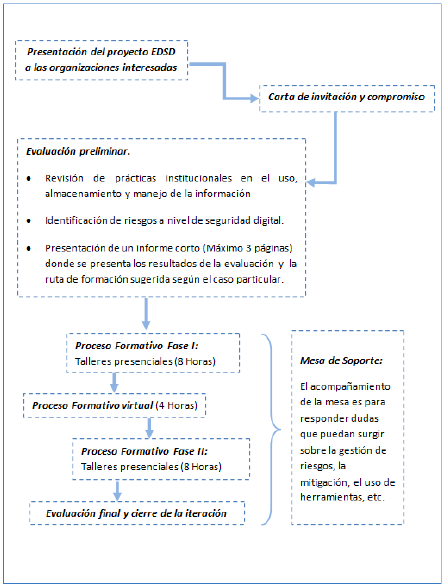
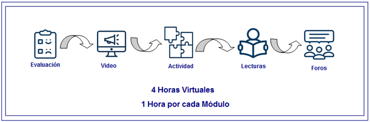
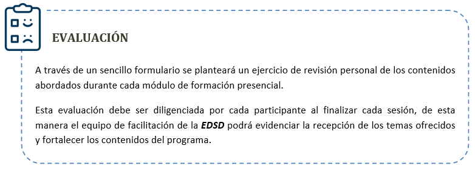
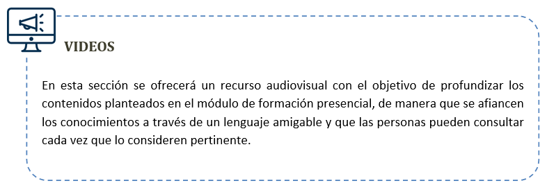
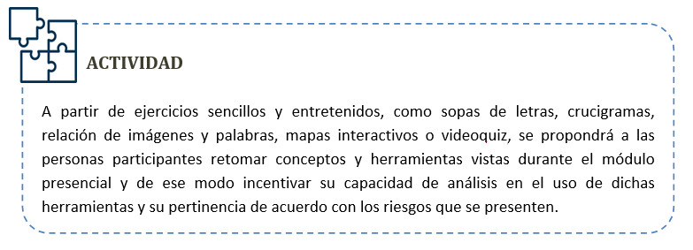
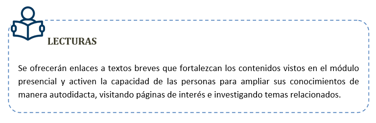
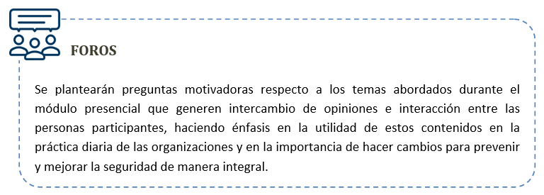

# Guía para la facilitación del proceso formativo

# Bienvenida
Este recurso se ha creado en el marco del Proyecto de Escuela de Seguridad Digital para la  implementación del proceso de acompañamiento en Seguridad Digital dirigido a organizaciones de la sociedad civil, defensores de derechos humanos, activistas, comunidad LGBT, ambientalistas y periodistas, entre otras. Este proyecto es apoyado por eQualit.ie y coordinado por Colnodo. 

El objetivo de esta guía es orientar a los facilitadores y facilitadoras respecto al diseño estructural, los lineamientos metodológicos y el plan de contenidos propio del proceso formativo de alfabetización en Seguridad Digital. 

Inicialmente se presenta la ruta de acompañamiento diseñada para ofrecer a las organizaciones un proceso coherente, basado en un panorama de riesgos en el uso y manejo de la información digital que muestra la evaluación preliminar aplicada a cada una de las instituciones participantes. A partir de esta evaluación se seleccionan los módulos de formación más pertinentes para cada una de las organizaciones, los cuales se desarrollaran en 16 horas presenciales y 4 virtuales, para un total de 20 horas de capacitación y una mesa de soporte que acompaña de manera permanente el proceso. 

Seguidamente, este documento presenta cada uno de los módulos de capacitación y recomendaciones para la formación, con descripciones detalladas de las actividades a desarrollar las cuales están orientadas a promover habilidades y prácticas relevantes que puedan aplicarse dentro de las organizaciones y ayuden a mitigar las vulnerabilidades en cuanto al manejo de información física y digital. 

En suma, esta currícula tiene el propósito de promover en las personas participantes el uso de herramientas y buenas prácticas para el manejo seguro de la información, de modo que puedan aplicar estos aprendizajes en sus organizaciones y en su vida cotidiana, haciendo de la seguridad digital una práctica diaria para la protección de su privacidad y la de las personas a quienes impacta su trabajo.  

## Ciclo de vida del proceso de acompañamiento

 
     

# Acerca de la Currícula

Esta currícula ha sido diseñada para orientar el proceso formativo que realizaran los y las facilitadoras de la Escuela de Seguridad Digital – ESD de Colnodo. De igual manera puede apoyar la labor de facilitación de personas que quieran conducir capacitaciones sobre conceptos y herramientas de seguridad digital a distintos grupos u organizaciones, pero es importante tener en cuenta que el conjunto completo de sesiones no es relevante para todos los públicos, así que la recomendación es identificar los módulos más adecuados para cada organización teniendo en cuenta una ***evaluación prelimina***.

El proceso formativo de la ESD tiene una duración de 20 horas, de las cuales 16 son presenciales y 4 virtuales. Para la implementación de la fase presencial se han diseñado 8 módulos que abarcan diversas temáticas relacionadas con anonimato, privacidad, navegación segura, correo electrónico, celulares y redes sociales, algunas de ellas en niveles básico e intermedio. Es importante decir que durante las 16 horas presenciales solo se abordarán 4 de estos 8 módulos, por ello los resultados de la evaluación preliminar son claves para priorizar los temas a abordar con cada organización.

Para el desarrollo de la fase virtual la ESD cuenta con una plataforma de aprendizaje que ofrecerá igualmente 8 módulos de formación de una (1) hora de duración, correspondientes con las temáticas planteadas en la fase presencial. De esta manera, la propuesta es que los 4 módulos que se aborden en las sesiones presenciales se complementen con una serie de recursos y actividades que los y las participantes deben realizar en línea para fortalecer sus habilidades y profundizar los contenidos vistos. 

En este documento los y las facilitadoras encontrarán la orientación necesaria para avanzar en cada una de las fases del proceso formativo, podrán consultar los contenidos diseñados para cada uno de los módulos, tendrán los insumos para planear las actividades de cada una de las sesiones y fortalecerán sus habilidades de facilitación a partir de las indicaciones metodológicas que estructuran esta propuesta pedagógica. 

Recuerden que hay tres elementos esenciales en el ejercicio de facilitación, uno es el conocimientos de los temas, otro las habilidades y destrezas para construir comunidad de aprendizaje con los y las participantes y el último, la actitud con la que se asume el proceso formativo. Y la fórmula es ___Conocimientos + Habilidades x Actitud___, el dominio de los temas y las habilidades suman, pero la actitud multiplica. 

Así que… ¡manos a la obra!   

# Modelo de Implementación

La estructura general del proceso formativo está organizada en fases y sesiones. Las veinte (20) horas de capacitación se realizarán en una fase presencial de 16 horas de duración y otra fase virtual de 4 horas. La fase presencial se realizará en dos etapas, las cuales tienen dos sesiones de formación de 4 horas cada una.

El cuadro que se presenta a continuación muestra la estructuración de este proceso:

 Ahora, los contenidos de la fase presencial están planteados en módulos y momentos. Cada módulo está diseñado para trabajarse *uno* por cada sesión de cuatro (4) horas e inician con el momento de introducción, luego el de contextualización de la información, seguido por un momento de práctica, luego el de síntesis y finalmente el momento de evaluación. En este orden se proponen actividades, juegos interactivos, materiales gráficos y audiovisuales, además de orientaciones diseñadas para apoyar la labor de los y las facilitadoras.

Esta estructura modular es muy pertinente ya que permite seleccionar los contenidos específicos que se ajustan a las necesidades de cada organización.

Como se muestra en el cuadro, es recomendable distribuir las sesiones presenciales en dos etapas, iniciando con dos sesiones de 4 horas cada una, para un total de 8 horas. Seguidamente, se propone dejar un lapso de una o dos semanas para que las personas participantes asimilen los primeros contenidos, profundicen sus conocimientos tomando las 4 horas de formación virtual disponibles en la plataforma de aprendizaje y soliciten apoyo a la mesa de ayuda si tienen alguna duda o desean mayor información sobre un tema en particular. Finalmente se abordará la segunda etapa de formación presencial, con dos sesiones de 4 horas cada una, culminando así con las últimas 8 horas de formación.

Esta currícula presenta diversas actividades y ejercicios diseñados de forma secuencial y con el propósito de crear un ambiente de aprendizaje agradable, abordar el tema de Seguridad Digital de una manera amena y fortalecer conceptos y habilidades que lleven a las personas participantes a incorporar las herramientas y prácticas de Seguridad Digital en su vida diaria, tanto en el ámbito personal como en el organizacional.

# Diseño metodológico

Cómo se ha mencionado a lo largo de este documento, la currícula es el recurso principal para los facilitadores y facilitadoras de Seguridad Digital, el cual orientará los contenidos de formación y comprende un total de ocho (__8__) módulos, en los cuales se abordarán temáticas específicas así:

___1. Principios de Seguridad Digital 1 - Básico.___

 ***2. Principios de Seguridad Digital 2 - Intermedio.*** 
 
 ___3. Anonimato 1- Básico.___
 
 ___4. Anonimato 2 - Intermedio.___
 
 ___5. Servidores de Correo electrónico seguro 1 - Básico.___
 
 ___6. Setvidores de Correo electónico seguro 2 - Intermedio.___
 
 ___7. Celulares y Comunicación segura.___  
 
 ___8. Redes Sociales.___
 

Cada una de estos módulos se ha estructurado en cinco (__5__) momentos, los cuales permitirán abordar el proceso formativo como una experiencia de construcción personal – colectiva de nuevos conocimientos e involucrar capacidades, emociones, habilidades y motivaciones. Por lo tanto, los contenidos del proceso pedagógico no pueden limitarse solo al aprendizaje de hechos y conceptos (contenido contextual), sino que es necesario atender en la misma medida a los procedimientos (contenido procedimental), las actitudes, los valores y las normas (contenido actitudinal), si se quiere una adaptación activa de los y las participantes a nuevas situaciones. Así mismo hay que considerar sus propios estilos, ritmos y estrategias de aprendizaje.

Por esta razón en todas las actividades se priorizará el acercamiento a las herramientas de manera práctica, como una estrategia que permita implementar los aprendizajes de seguridad digital en la vida diaria de las personas y en la cultura organizacional de las entidades; y con ello mitigar las vulnerabilidades encontradas en la evaluación inicial.

A continuación se describen los momentos que estructuran cada uno de los módulos:

 ___- Introducción:___  En este momento se hará una presentación de los contenidos y objetivos del módulo, así como también la exposición de la ruta de aprendizaje, los acuerdos de convivencia y participación en la sesión.
 
 ***-Contextualización de la Información:*** Hace referencia a los conceptos de cada uno de los temas a tratar en el módulo, este momento está enfocado a fortalecer conocimientos teóricos, que le permitirán a los participantes usar de una forma más eficiente las herramientas presentadas. 

___-Práctica:___ Será el escenario donde los participantes podrán realizar diferentes actividades prácticas diseñadas para cada módulo. En este momento la práctica será un elemento esencial en la relación enseñanza – aprendizaje, en donde el o la facilitadora podrá acompañarles de una manera permanente resolviendo dudas y orientando el proceso.

___-Síntesis:___  En este momento los y las participantes socializarán su experiencia de aprendizaje, así mismo aclararan dudas relacionadas con los temas tratados, durante esta síntesis el facilitador o facilitadora incluirá algunas preguntas claves que permitirán reforzar aún más los conceptos y así evidenciar la comprensión de los temas presentados en el módulo.

___-Evaluación:___ Este momento final le permitirá a los y las participantes expresar su percepción frente al desarrollo de la metodología y logística de la sesión, esto con el fin de organizar y mejorar posibles falencias en las sesiones siguientes.

# Plataforma Virtual Escuela de Seguridad Digital

# Estructura de contenidos

| _**01 - Principios de Seguridad Digital 1 - Básico**_ |  
|---|  
| _**(4 Horas)**_ |  
| En este módulo los participantes conocerán cómo funciona Internet, los métodos de navegación más seguros, cómo proteger la computadora contra malware y acceso sin consentimiento a la información.|  
|<ul><li>¿Cómo funciona Internet?</li><li>Como hacer más segura nuestra computadora.</li><li>Malware y Virus.</li><li>Creación de contraseñas seguras.</li><li>Autenticación de dos factores.</li></ul>|

| _**02 - Principios de Seguridad Digital 2 - Intermedio**_ |  
|---|  
| _**(4 Horas)**_ |  
|Para este módulo los participantes aprenderán almacenar y asegurar la información más relevante, así mismo aplicaran técnicas y herramientas para recuperar información borrada de forma no segura. |  
|<ul><li>Recuperación de información.</li><li>Eliminación permanente de información.</li><li>Copias de Seguridad de la Información.</li><li>Almacenamiento y Cifrado>Recuperación de información.</li></ul>|

| _**03 - Anonimato 1 - Básico**_ |  
|---|  
| _**(4 Horas)**_ |  
|En este módulo los participantes conseguirán identificar cuando sus datos e información son utilizados para fines comerciales y así mismo tomar las correctivos correspondientes para que esto no suceda. |  
|<ul><li>Navegadores y motores de búsqueda.</li><li>¿Qué son los metadatos?</li><li>Pautas de navegación segura.</li><li>Buenas prácticas de navegación.</li></ul>|

| _**04 - Anonimato 2 - Intermedio**_ |  
|---|  
| _**(4 Horas)**_ |  
| En este módulo los participantes lograrán reconocer los espacios virtuales para así obtener un control de las identidades y rastros que dejan en Internet. |  
|<ul><li>Virtual Private Network (VPN)</li><li>Protocolos seguros de navegación HTTPS y certificados de seguridad SSL</li><li>Navegador TOR - Sistema Operativo TAILS</li></ul>|

| _**05 - Servidores de Correo electrónico seguro 1 – Básico**_ |  
|---|  
| _**(4 Horas)**_ |  
|En este módulo el participante conocerá más a fondo el funcionamiento del correo electrónico, aprenderá a manejar herramientas para la administración de mensajes, y la caracterización de riesgos a los que está expuesta la información.|  
|<ul><li>Funcionamiento del correo electrónico.</li><li>Configuración de clientes de correo electrónico.</li><li>Quien ve el contenido del correo electrónico.</li><li>Cómo evitar los ataques de phishing o suplantación de identidad</li><li>Acerca de la privacidad del correo electrónico.</li><li>Modelo de negocio de los correos gratuito.</li></ul>|

| _**06 - Servidores de Correo electrónico seguro 2 – Intermedio**_ |  
|---|  
| _**(4 Horas)**_ |  
|En este módulo los participantes conocerán y trabajaran algunas de las formas que hay para cifrar los mensajes en los servicios de correo electrónico por medio de herramientas fáciles y gratuitas. |  
|<ul><li>Mensajes cifrados.</li><li>Funcionamiento de PGP.</li><li>Protección de la comunicación utilizando SSL/TLS.</li><li>Instalación y configuración de Enigmail.</li><l1>Importancia del correo cifrado.</li></ul>|

| _**07 - Celulares y comunicación segura**_ |  
|---|  
| _**(4 Horas)**_ |  
|Con este módulo los participantes comprenderán el funcionamiento de los dispositivos móviles, adquirirán conocimientos que les servirán para tener más control sobre la información que almacenan en estos dispositivos.|  
|<ul><li>Reconocimiento del celular.</li><li>Manejo de información en el dispositivo móvil.</li><li>Apps & Plataformas online: ¿Amigo/a o enemigo/a?</li></ul>|

| _**08 - Redes Sociales**_ |  
|---|  
| _**(4 Horas)**_ |  
|Para este módulo los participantes aprenderán a reconocer y abordar los riesgos a los cuales se exponen  al momento de publicar cierta información en Redes sociales, por medio de pautas que le permitirán mitigar las vulnerabilidades a las cuales están más expuestos.|  
|<ul><li>Configuración de opciones de seguridad y privacidad.</li><li>Recomendaciones para el Uso Seguro de Internet y las Redes Sociales.</li><li>Impacto de la información que se publica en redes sociales.</li><li>Modelo de negocio y riesgos de las redes sociales.</li></ul>|

# Agenda de Implementación

  
|   __PRESENTACIÓN INICIAL - PRIMERA SESIÓN__  *Tiempo total: 15 Minutos*| 
|---|   
| _Bienvenida al proceso formativo de la Escuela de Seguridad Digital._ <ul><li>_Presentación de los Objetivos de la Escuela de Seguridad Digital._</li><li>_Presentación del Kit de Seguridad Digital._</li><li>Actividad: Presentación de las personas participantes.</li><li>Actividad: Reglas de Juego de los talleres de capacitación.</li></ul>|   

| PRESENTACIÓN INICIAL - PRIMERA SESIÓN  *Tiempo total: 15 Minutos*|  
|---|  
| _Bienvenida al proceso formativo de la Escuela de Seguridad Digital._ <ul><li>_Presentación de los Objetivos de la Escuela de Seguridad Digital._</li><li>_Presentación del Kit de Seguridad Digital._</li><li>_Actividad: Presentación de las personas participantes._</li><li>_Actividad: Reglas de Juego de los talleres de capacitación._</li></ul>|  
| ___ACTIVIDADES-PRESENTACIÓN___ (*Puedes escoger una de las tres actividades propuestas*)<ol>___<li>___Endulza tu entorno___  Duración: 5 Minutos Materiales requeridos:<ul><li>1 o 2 bolsas de dulces.</li><li> Escarapela y Marcadores.</li></ul> ___¿Cómo conducir la actividad?___ Los facilitadores deberán ofrecerles dulces a todas las personas del grupo, indicando que puedan tomar de uno a tres dulces, al finalizar la entrega los facilitadores deberán indicar que por cada dulce tomado por el participante este debe compartir su nombre y un detalle o cualidad. Al terminar de hablar el participante deberá escribir su nombre en la escarapela y colocarlo en un lugar visible de su cuerpo.</li> <li> _Fila India_ Duración:5 Minutos Materiales requeridos:<ul><li>Cinta adhesiva.</li><li>Escarapela y Marcadores.</li></ul> _¿Cómo conducir la actividad?_ Se les pide a los participantes colocar su nombre en Escarapelas y colocarlos en un lugar visible de su cuerpo, luego hacemos una línea en el suelo con cinta adhesiva (preferiblemente) y les advertimos a los participantes que no se pueden salir de la línea, entonces todos los participantes se colocan sobre línea y se les pide que se ordenen por orden alfabético, pero teniendo cuidado de no dejar de pisar la línea. Se puede dar un tiempo para darle más emoción. Al final se comprueba que la fila india ha quedado bien presentándose cada uno por orden.</li>  <li>_Crucemos nuestros nombres_ Duración: 5 Minutos Materiales requeridos:<ul><li> Tablero.</li> <li>Escarapela y Marcadores.</li></ul> _¿Cómo conducir la actividad?_ La actividad consiste en escribir en el tablero todos los nombres unidos entre sí. Primero pueden salir los facilitadores escriben su nombre en el tablero y hacen una pequeña presentación, a que se dedica, que le gusta, cuales son las expectativas, etc… luego los demás participantes van saliendo de uno en uno, y realizan la misma metodología hasta terminar con todos. Al terminar de hablar el participante deberá escribir su nombre en la escarapela y colocarlo en un lugar visible de su cuerpo.</li></ol>|
<!--stackedit_data:
eyJoaXN0b3J5IjpbLTcwNzY0NTgzOCwtMTUyMzgzNzg0NywtMT
k5ODY3MDgwMywxMjIyNjcxNzE1LDE2NzE3MTIwMjksLTE1NTYy
NDIxOTksLTQzODgwMzMxMywyMTM3NTU1MjUxLDEyNDk4ODYzMT
YsLTEzMTg2ODY3NTMsLTIxNDU2NjkzOTEsMTYxOTcwNDc0Niwt
MTcxOTc3NDAzNSwtMTk0NjE2NDU3NSw5Mzg2NTc2MDcsMTk1Nj
k2NzI5OSwtMTUyMjExMTM0OSwtMTQyNzYxMzY0MywtMTU3NTg2
MDU0LC00MDAxNzYyNTBdfQ==
-->