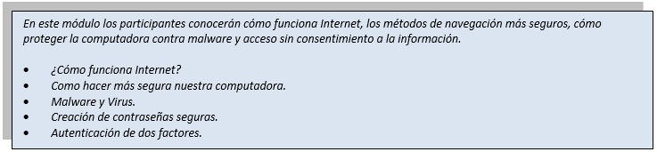
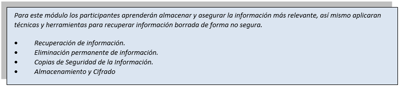
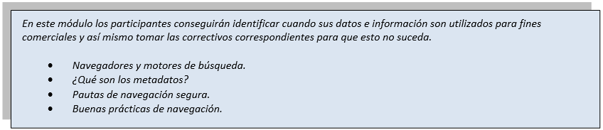
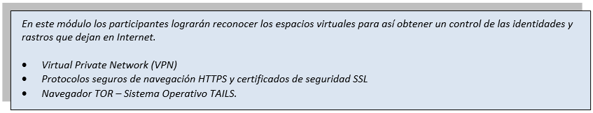
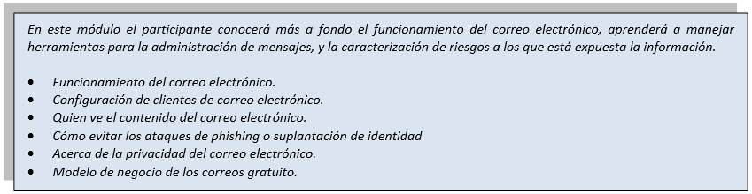
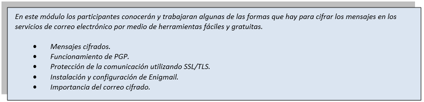
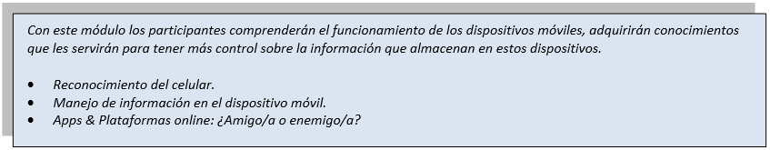
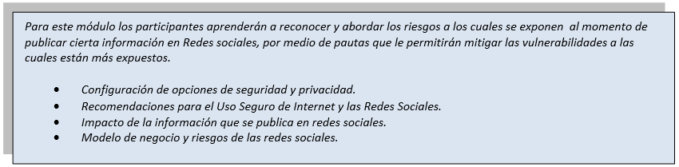
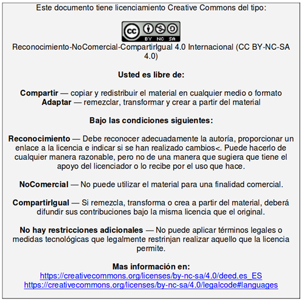

# Guía para la facilitación del proceso formativo

# Bienvenida
Este recurso se ha creado en el marco del Proyecto de Escuela de Seguridad Digital para la  implementación del proceso de acompañamiento en Seguridad Digital dirigido a organizaciones de la sociedad civil, defensores de derechos humanos, activistas, comunidad LGBT, ambientalistas y periodistas, entre otras. Este proyecto es apoyado por eQualit.ie y coordinado por Colnodo. 

El objetivo de esta guía es orientar a los facilitadores y facilitadoras respecto al diseño estructural, los lineamientos metodológicos y el plan de contenidos propio del proceso formativo de alfabetización en Seguridad Digital. 

Inicialmente se presenta la ruta de acompañamiento diseñada para ofrecer a las organizaciones un proceso coherente, basado en un panorama de riesgos en el uso y manejo de la información digital que muestra la evaluación preliminar aplicada a cada una de las instituciones participantes. A partir de esta evaluación se seleccionan los módulos de formación más pertinentes para cada una de las organizaciones, los cuales se desarrollaran en 16 horas presenciales y 4 virtuales, para un total de 20 horas de capacitación y una mesa de soporte que acompaña de manera permanente el proceso. 

Seguidamente, este documento presenta cada uno de los módulos de capacitación y recomendaciones para la formación, con descripciones detalladas de las actividades a desarrollar las cuales están orientadas a promover habilidades y prácticas relevantes que puedan aplicarse dentro de las organizaciones y ayuden a mitigar las vulnerabilidades en cuanto al manejo de información física y digital. 

En suma, esta currícula tiene el propósito de promover en las personas participantes el uso de herramientas y buenas prácticas para el manejo seguro de la información, de modo que puedan aplicar estos aprendizajes en sus organizaciones y en su vida cotidiana, haciendo de la seguridad digital una práctica diaria para la protección de su privacidad y la de las personas a quienes impacta su trabajo.  

## Ciclo de vida del proceso de acompañamiento

 
     

# Acerca de la Currícula

Esta currícula ha sido diseñada para orientar el proceso formativo que realizaran los y las facilitadoras de la Escuela de Seguridad Digital – ESD de Colnodo. De igual manera puede apoyar la labor de facilitación de personas que quieran conducir capacitaciones sobre conceptos y herramientas de seguridad digital a distintos grupos u organizaciones, pero es importante tener en cuenta que el conjunto completo de sesiones no es relevante para todos los públicos, así que la recomendación es identificar los módulos más adecuados para cada organización teniendo en cuenta una ***evaluación prelimina***.

El proceso formativo de la ESD tiene una duración de 20 horas, de las cuales 16 son presenciales y 4 virtuales. Para la implementación de la fase presencial se han diseñado 8 módulos que abarcan diversas temáticas relacionadas con anonimato, privacidad, navegación segura, correo electrónico, celulares y redes sociales, algunas de ellas en niveles básico e intermedio. Es importante decir que durante las 16 horas presenciales solo se abordarán 4 de estos 8 módulos, por ello los resultados de la evaluación preliminar son claves para priorizar los temas a abordar con cada organización.

Para el desarrollo de la fase virtual la ESD cuenta con una plataforma de aprendizaje que ofrecerá igualmente 8 módulos de formación de una (1) hora de duración, correspondientes con las temáticas planteadas en la fase presencial. De esta manera, la propuesta es que los 4 módulos que se aborden en las sesiones presenciales se complementen con una serie de recursos y actividades que los y las participantes deben realizar en línea para fortalecer sus habilidades y profundizar los contenidos vistos. 

En este documento los y las facilitadoras encontrarán la orientación necesaria para avanzar en cada una de las fases del proceso formativo, podrán consultar los contenidos diseñados para cada uno de los módulos, tendrán los insumos para planear las actividades de cada una de las sesiones y fortalecerán sus habilidades de facilitación a partir de las indicaciones metodológicas que estructuran esta propuesta pedagógica. 

Recuerden que hay tres elementos esenciales en el ejercicio de facilitación, uno es el conocimientos de los temas, otro las habilidades y destrezas para construir comunidad de aprendizaje con los y las participantes y el último, la actitud con la que se asume el proceso formativo. Y la fórmula es ___Conocimientos + Habilidades x Actitud___, el dominio de los temas y las habilidades suman, pero la actitud multiplica. 

Así que… ¡manos a la obra!   

# Modelo de Implementación

La estructura general del proceso formativo está organizada en fases y sesiones. Las veinte (20) horas de capacitación se realizarán en una fase presencial de 16 horas de duración y otra fase virtual de 4 horas. La fase presencial se realizará en dos etapas, las cuales tienen dos sesiones de formación de 4 horas cada una.

El cuadro que se presenta a continuación muestra la estructuración de este proceso:

 Ahora, los contenidos de la fase presencial están planteados en módulos y momentos. Cada módulo está diseñado para trabajarse *uno* por cada sesión de cuatro (4) horas e inician con el momento de introducción, luego el de contextualización de la información, seguido por un momento de práctica, luego el de síntesis y finalmente el momento de evaluación. En este orden se proponen actividades, juegos interactivos, materiales gráficos y audiovisuales, además de orientaciones diseñadas para apoyar la labor de los y las facilitadoras.

Esta estructura modular es muy pertinente ya que permite seleccionar los contenidos específicos que se ajustan a las necesidades de cada organización.

Como se muestra en el cuadro, es recomendable distribuir las sesiones presenciales en dos etapas, iniciando con dos sesiones de 4 horas cada una, para un total de 8 horas. Seguidamente, se propone dejar un lapso de una o dos semanas para que las personas participantes asimilen los primeros contenidos, profundicen sus conocimientos tomando las 4 horas de formación virtual disponibles en la plataforma de aprendizaje y soliciten apoyo a la mesa de ayuda si tienen alguna duda o desean mayor información sobre un tema en particular. Finalmente se abordará la segunda etapa de formación presencial, con dos sesiones de 4 horas cada una, culminando así con las últimas 8 horas de formación.

Esta currícula presenta diversas actividades y ejercicios diseñados de forma secuencial y con el propósito de crear un ambiente de aprendizaje agradable, abordar el tema de Seguridad Digital de una manera amena y fortalecer conceptos y habilidades que lleven a las personas participantes a incorporar las herramientas y prácticas de Seguridad Digital en su vida diaria, tanto en el ámbito personal como en el organizacional.

# Diseño metodológico

Cómo se ha mencionado a lo largo de este documento, la currícula es el recurso principal para los facilitadores y facilitadoras de Seguridad Digital, el cual orientará los contenidos de formación y comprende un total de ocho (__8__) módulos, en los cuales se abordarán temáticas específicas así:<ol><li type=1>***Principios de Seguridad Digital 1 - Básico.***</li><li type=1>Principios de Seguridad Digital 2 - Intermedio.</li><li type=1>Anonimato 1- Básico.</li><li type=1>Anonimato 2 - Intermedio.</li><li type=1>Servidores de Correo electrónico seguro 1 - Básico.</li><li type=1>Servidores de Correo electónico seguro 2 - Intermedio.</li><li type=1>Celulares y Comunicación segura.</li><li type=1>Redes Sociales.</li></ol>

Cada una de estos módulos se ha estructurado en cinco (__5__) momentos, los cuales permitirán abordar el proceso formativo como una experiencia de construcción personal – colectiva de nuevos conocimientos e involucrar capacidades, emociones, habilidades y motivaciones. Por lo tanto, los contenidos del proceso pedagógico no pueden limitarse solo al aprendizaje de hechos y conceptos (contenido contextual), sino que es necesario atender en la misma medida a los procedimientos (contenido procedimental), las actitudes, los valores y las normas (contenido actitudinal), si se quiere una adaptación activa de los y las participantes a nuevas situaciones. Así mismo hay que considerar sus propios estilos, ritmos y estrategias de aprendizaje.

Por esta razón en todas las actividades se priorizará el acercamiento a las herramientas de manera práctica, como una estrategia que permita implementar los aprendizajes de seguridad digital en la vida diaria de las personas y en la cultura organizacional de las entidades; y con ello mitigar las vulnerabilidades encontradas en la evaluación inicial.

A continuación se describen los momentos que estructuran cada uno de los módulos:<ul><li type=disc>***Introducción:*** En este momento se hará una presentación de los contenidos y objetivos del módulo, así como también la exposición de la ruta de aprendizaje, los acuerdos de convivencia y participación en la sesión.</li><li type=disc> ***Contextualización de la Información:*** Hace referencia a los conceptos de cada uno de los temas a tratar en el módulo, este momento está enfocado a fortalecer conocimientos teóricos, que le permitirán a los participantes usar de una forma más eficiente las herramientas presentadas. </li><li type=disc>***Práctica:*** Será el escenario donde los participantes podrán realizar diferentes actividades prácticas diseñadas para cada módulo. En este momento la práctica será un elemento esencial en la relación enseñanza – aprendizaje, en donde el o la facilitadora podrá acompañarles de una manera permanente resolviendo dudas y orientando el proceso.</li><li type=disc>___Síntesis:___  En este momento los y las participantes socializarán su experiencia de aprendizaje, así mismo aclararan dudas relacionadas con los temas tratados, durante esta síntesis el facilitador o facilitadora incluirá algunas preguntas claves que permitirán reforzar aún más los conceptos y así evidenciar la comprensión de los temas presentados en el módulo.</li><li type=disc>___Evaluación:___ Este momento final le permitirá a los y las participantes expresar su percepción frente al desarrollo de la metodología y logística de la sesión, esto con el fin de organizar y mejorar posibles falencias en las sesiones siguientes.</li></ul>

# Plataforma Virtual Escuela de Seguridad Digital

# Estructura de contenidos

| _**01 - Principios de Seguridad Digital 1 - Básico**_ |  
|---|  
| _**(4 Horas)**_ |  
| En este módulo los participantes conocerán cómo funciona Internet, los métodos de navegación más seguros, cómo proteger la computadora contra malware y acceso sin consentimiento a la información.|  
|<ul><li>¿Cómo funciona Internet?</li><li>Como hacer más segura nuestra computadora.</li><li>Malware y Virus.</li><li>Creación de contraseñas seguras.</li><li>Autenticación de dos factores.</li></ul>|

| _**02 - Principios de Seguridad Digital 2 - Intermedio**_ |  
|---|  
| _**(4 Horas)**_ |  
|Para este módulo los participantes aprenderán almacenar y asegurar la información más relevante, así mismo aplicaran técnicas y herramientas para recuperar información borrada de forma no segura. |  
|<ul><li>Recuperación de información.</li><li>Eliminación permanente de información.</li><li>Copias de Seguridad de la Información.</li><li>Almacenamiento y Cifrado>Recuperación de información.</li></ul>|

| _**03 - Anonimato 1 - Básico**_ |  
|---|  
| _**(4 Horas)**_ |  
|En este módulo los participantes conseguirán identificar cuando sus datos e información son utilizados para fines comerciales y así mismo tomar las correctivos correspondientes para que esto no suceda. |  
|<ul><li>Navegadores y motores de búsqueda.</li><li>¿Qué son los metadatos?</li><li>Pautas de navegación segura.</li><li>Buenas prácticas de navegación.</li></ul>|

| _**04 - Anonimato 2 - Intermedio**_ |  
|---|  
| _**(4 Horas)**_ |  
| En este módulo los participantes lograrán reconocer los espacios virtuales para así obtener un control de las identidades y rastros que dejan en Internet. |  
|<ul><li>Virtual Private Network (VPN)</li><li>Protocolos seguros de navegación HTTPS y certificados de seguridad SSL</li><li>Navegador TOR - Sistema Operativo TAILS</li></ul>|

| _**05 - Servidores de Correo electrónico seguro 1 – Básico**_ |  
|---|  
| _**(4 Horas)**_ |  
|En este módulo el participante conocerá más a fondo el funcionamiento del correo electrónico, aprenderá a manejar herramientas para la administración de mensajes, y la caracterización de riesgos a los que está expuesta la información.|  
|<ul><li>Funcionamiento del correo electrónico.</li><li>Configuración de clientes de correo electrónico.</li><li>Quien ve el contenido del correo electrónico.</li><li>Cómo evitar los ataques de phishing o suplantación de identidad</li><li>Acerca de la privacidad del correo electrónico.</li><li>Modelo de negocio de los correos gratuito.</li></ul>|

| _**06 - Servidores de Correo electrónico seguro 2 – Intermedio**_ |  
|---|  
| _**(4 Horas)**_ |  
|En este módulo los participantes conocerán y trabajaran algunas de las formas que hay para cifrar los mensajes en los servicios de correo electrónico por medio de herramientas fáciles y gratuitas. |  
|<ul><li>Mensajes cifrados.</li><li>Funcionamiento de PGP.</li><li>Protección de la comunicación utilizando SSL/TLS.</li><li>Instalación y configuración de Enigmail.</li><l1>Importancia del correo cifrado.</li></ul>|

| _**07 - Celulares y comunicación segura**_ |  
|---|  
| _**(4 Horas)**_ |  
|Con este módulo los participantes comprenderán el funcionamiento de los dispositivos móviles, adquirirán conocimientos que les servirán para tener más control sobre la información que almacenan en estos dispositivos.|  
|<ul><li>Reconocimiento del celular.</li><li>Manejo de información en el dispositivo móvil.</li><li>Apps & Plataformas online: ¿Amigo/a o enemigo/a?</li></ul>|

| _**08 - Redes Sociales**_ |  
|---|  
| _**(4 Horas)**_ |  
|Para este módulo los participantes aprenderán a reconocer y abordar los riesgos a los cuales se exponen  al momento de publicar cierta información en Redes sociales, por medio de pautas que le permitirán mitigar las vulnerabilidades a las cuales están más expuestos.|  
|<ul><li>Configuración de opciones de seguridad y privacidad.</li><li>Recomendaciones para el Uso Seguro de Internet y las Redes Sociales.</li><li>Impacto de la información que se publica en redes sociales.</li><li>Modelo de negocio y riesgos de las redes sociales.</li></ul>|

# Agenda de Implementación

  
|   __PRESENTACIÓN INICIAL - PRIMERA SESIÓN__  *Tiempo total: 15 Minutos*| 
|---|   
| _Bienvenida al proceso formativo de la Escuela de Seguridad Digital._ <ul><li>_Presentación de los Objetivos de la Escuela de Seguridad Digital._</li><li>_Presentación del Kit de Seguridad Digital._</li><li>Actividad: Presentación de las personas participantes.</li><li>Actividad: Reglas de Juego de los talleres de capacitación.</li></ul>|   
| PRESENTACIÓN INICIAL - PRIMERA SESIÓN  *Tiempo total: 15 Minutos* _Bienvenida al proceso formativo de la Escuela de Seguridad Digital._ <ul><li>_Presentación de los Objetivos de la Escuela de Seguridad Digital._</li><li>_Presentación del Kit de Seguridad Digital._</li><li>_Actividad: Presentación de las personas participantes._</li><li>_Actividad: Reglas de Juego de los talleres de capacitación._</li></ul>|  
| ___ACTIVIDADES-PRESENTACIÓN___ *(Puedes escoger una de las tres actividades propuestas)*<ol><li>___Endulza tu entorno___  Duración: 5 Minutos Materiales requeridos:<ul><li  type=disc>1 o 2 bolsas de dulces.</li><li type=disc> Escarapela y Marcadores.</li></ul> __*¿Cómo conducir la actividad*__ Los facilitadores deberán ofrecerles dulces a todas las personas del grupo, indicando que puedan tomar de uno a tres dulces, al finalizar la entrega los facilitadores deberán indicar que por cada dulce tomado por el participante este debe compartir su nombre y un detalle o cualidad. Al terminar de hablar el participante deberá escribir su nombre en la escarapela y colocarlo en un lugar visible de su cuerpo.</li> <li> __*Fila India*__ Duración:5 Minutos Materiales requeridos:<ul><li type=disc>Cinta adhesiva.</li><li type=disc>Escarapela y Marcadores.</li></ul> __*¿Cómo conducir la actividad?*__ Se les pide a los participantes colocar su nombre en Escarapelas y colocarlos en un lugar visible de su cuerpo, luego hacemos una línea en el suelo con cinta adhesiva (preferiblemente) y les advertimos a los participantes que no se pueden salir de la línea, entonces todos los participantes se colocan sobre línea y se les pide que se ordenen por orden alfabético, pero teniendo cuidado de no dejar de pisar la línea. Se puede dar un tiempo para darle más emoción. Al final se comprueba que la fila india ha quedado bien presentándose cada uno por orden.</li>  <li>__*Crucemos nuestros nombres*__ Duración: 5 Minutos Materiales requeridos:<ul><li type=disc> Tablero.</li> <li type=disc>Escarapela y Marcadores.</li></ul> __*¿Cómo conducir la actividad?*__ La actividad consiste en escribir en el tablero todos los nombres unidos entre sí. Primero pueden salir los facilitadores escriben su nombre en el tablero y hacen una pequeña presentación, a que se dedica, que le gusta, cuales son las expectativas, etc… luego los demás participantes van saliendo de uno en uno, y realizan la misma metodología hasta terminar con todos. Al terminar de hablar el participante deberá escribir su nombre en la escarapela y colocarlo en un lugar visible de su cuerpo.</li></ol>|

|  **ACTIVIDAD-REGLAS DE JUEGO**  ___Reglas del Juego___ |
|---|
|Objetivo: Construir colectivamente acuerdos de convivencia y participación. “Las reglas del juego”. Duración: 5 minutos. Materiales requeridos:<ul><li>Tablero.</li><li>Marcadores.</li><li>Stickers de colores preferiblemente rojo y amarillo.</li></ul> __*¿Cómo conducir la actividad?*__ Esta actividad  ayudará a generar  acuerdos colectivos de convivencia, reconociendo las preferencias de las personas participantes, para que puedan sentirse cómodas, y pueda dar lugar a mayor receptividad durante la sesión.  <ol>a. _Pídeles a las personas participantes que den ejemplos de acuerdos de convivencia que consideren importantes para su bienestar en la sesión. Los facilitadores pueden iniciar dando ejemplos como “levantar la mano para pedir la palabra”, “No usar dispositivos móviles durante la sesión” o “no compartiremos nada sobre la sesión en plataformas de redes sociales sin el consentimiento de las demás personas” El facilitador deberá anotar cada uno de los cuerdos en el tablero o en un lugar visible e indicar que pueden ser modificados en la medida que se discutan y consensuen en grupo._</ol> _Nota: Asegúrate de ofrecer a las personas participantes la opción de hacer sugerencias directamente a ti o de manera anónima en caso de que no se sientan cómodas de hacerlo abiertamente._  <ol>_b._ _Los Stickers les permitirán hacer referencia a condiciones especiales a las personas participantes, pueden asignar una condición a cada color, e indicarles que pueden tomar uno y pegarlo a su Escarapela según lo vean necesario y de manera individual en cualquier momento de la sesión para no generar incomodidades. Por ejemplo:_ <ul><li type=disc>_Rojo:_ _El contacto físico me incomoda un poco. Por favor, respeta mi espacio._</li><li type=disc>_Amarillo: No deseo salir en ningún registro fotográfico. (Toma de fotos sin consentimiento)._</li></ul>|

# Principios de Seguridad Digital 1 – Básico
**_Tiempo total: 4 Horas_**

 

__¿Cómo conducir la actividad?__

### INTRODUCCIÓN.
__Duración: 5 Minutos.__

Los facilitadores presentaran de una manera global a las personas participantes  los temas que se presentaran en el transcurso de la sesión, la metodología de trabajo (Ruta de aprendizaje) y mencionaran nuevamente los acuerdos de convivencia y participación en la sesión.  _(Presentación anexa en la carpeta de material de trabajo)_

### CONTEXTUALIZACIÓN
__Duración: 1 Hora 30 Minutos.__

Esta etapa estará enfocada a fortalecer conocimientos teóricos<ol><li type=a>Los facilitadores harán uso de la presentación correspondiente al módulo _Principios de Seguridad Digital 1 – Básico_  _(Presentación anexa en la carpeta de material de trabajo)_<li type=a>Los facilitadores realizaran  distintas actividades en el transcurso de las presentaciones, con el objetivo de que las personas participantes afiancen mejor los conceptos con ejemplos prácticos.</li></ol>

**ACTIVIDAD 1 - ¿CÓMO FUNCIONA INTERNET?**

Trabajando en parejas, las personas participantes recibirán tarjetas representando diferentes componentes de una cadena de flujo de información (módem, computadora, proveedor de servicio de internet, antenas, routers, servidores,  etc.). Los facilitadores le pedirán a los grupos que ordenen correctamente las tarjetas para evidenciar cuál sería el flujo de información que se haría al momento de enviar un correo a través de Internet.

_Los facilitadores realizaran observaciones del orden de las tarjetas y repasaran el proceso con el grupo, los facilitadores podrán apoyarse con el siguiente recurso audiovisual https://www.youtube.com/watch?v=7_LPdttKXPc_

**ACTIVIDAD 2 - CREACIÓN DE CONTRASEÑAS SEGURAS**

Trabajando en parejas, las personas participantes recibirán unos DADOS que vienen dentro de los materiales del KIT de Seguridad Digital, los facilitadores darán las indicaciones y suministraran el cuadernillo con la explicación de la actividad.

###  PRÁCTICA
__Duración: 2 Horas__

En esta etapa la práctica será un elemento esencial en la relación de enseñanza – aprendizaje, el facilitador/a acompañará a las personas participantes de una manera permanente resolviendo dudas y orientando el proceso.

**¡MANOS A LA OBRA!** (*USO KEEPASS*) Las personas participantes tendrán que realizar las siguientes actividades en sus computadores o en los computadores de la sala del taller siguiendo las siguientes instrucciones:<ul><li>Instalación y configuración de Idioma en Español  del Keepass.</li><li>Creación de un archivo .kdb</li><li>Creación de un repositorio de información con mínimo 3 cuentas de servicios de Internet.</li></ul>

### SÍNTESIS
__Duración: 15 Minutos__
<ol><li type=a > Los facilitadores realizaran algunas preguntas claves que permitirán reforzar y repasar los contenidos presentados, con el fin  de evidenciar la comprensión de los temas presentados en el módulo.</li><ul><li  type=disc> ¿Cuáles son las características que debe tener una contraseña segura? </li><li type=disc> ¿Qué herramientas permiten hacen más segura nuestras computadoras?</li><li type=disc>¿Qué significa Malware? ¿Qué consecuencias traen?</li><li type=disc> Explique es sus propias palabras que es la autenticación de dos factores.</li></ul><li type=a>Los facilitadores darán la palabra a las personas participantes para que libremente hagan  preguntas y aclaren sus dudas.</li></ol>

### EVALUACIÓN
__Duración: 10 Minutos__

Materiales requeridos: Hojas de papel con un termómetro. (_Anexo en la carpeta de material de trabajo_) **_¿Cómo conducir la actividad?_**  **_“EL TERMÓMETRO”_**  Los facilitadores repartirán una hoja la cual tiene dibujado un termómetro con tres aspectos a evaluar >> ¿Qué te gusto?, ¿Qué aprendiste?, ¿Qué mejorarías? Los facilitadores darán las instrucciones a las personas participantes para que coloquen allí sus opiniones en cada uno de los aspectos indicados. Al finalizar la sesión se recogerán las hojas y se socializaran con el equipo de la EDSD.

# Principios de Seguridad Digital 2 – Intermedio
**_Tiempo total: 4 Horas_**

___¿Cómo conducir la actividad?___

### INTRODUCCIÓN
Duración: 5 Minutos 
Los facilitadores presentaran de una manera global a las personas participantes  los temas que se presentaran en el transcurso de la sesión, la metodología de trabajo (Ruta de aprendizaje) y mencionaran nuevamente los acuerdos de convivencia y participación en la sesión.  _( Presentación anexa en la carpeta de material de trabajo)_

### CONTEXTUALIZACIÓN
Duración: 1 Hora 30 Minutos

Esta etapa estará enfocada a fortalecer conocimientos teóricos<ol> <li type=a>Los facilitadores harán uso de la presentación correspondiente al módulo _Principios de Seguridad Digital 2 – Intermedio_ (_Presentación anexa en la carpeta de material de trabajo_)</li><li type=a>Los facilitadores realizaran  distintas actividades en el transcurso de las presentaciones, con el objetivo de que las personas participantes afiancen mejor la teoría con ejemplos prácticos.</li></ol>

**ACTIVIDAD 1 – EL A, B, C DE LA INFORMACIÓN**

Los facilitadores dividirán a las personas participantes en tres grupos, donde cada uno de ellos tendrá actividades diferentes:<ul><li type=disc>**_Grupo A_**: Elaborara un listado de que tipos de archivos o información importante que manejan tanto en computadores como en dispositivos móviles, cada uno de ellos se debe colocar en una cartulina diferente.</li><li type=disc>**_Grupo B_**: Elaborara un listado de mecanismos o formas en las que se puede perder información, cada uno de ellos se debe colocar en una cartulina diferente.</li><li type=disc>**_Grupo C_**: Elaborara un listado con modos de prevención que conozcan en el manejo de la información (Herramientas o prácticas), cada uno de ellos se debe colocar en una cartulina diferente.</li></ul>

Una vez finalizada la instrucción, se pasará a realizar un mapeo juntando la información y se socializaran con todos los grupos.  Se corregirán los posibles errores y se aclararán dudas que puedan surgir.

### PRÁCTICA
Duración: 1 Hora 40 Minutos

En esta etapa la práctica será un elemento esencial en la relación de enseñanza – aprendizaje, el facilitador/a acompañará a las personas participantes de una manera permanente resolviendo dudas y orientando el proceso.

**¡MANOS A LA OBRA!** (*USO RECUVA - ERASER*)  Las personas participantes tendrán que realizar las siguientes actividades en sus computadores o en los computadores de la sala del taller siguiendo las siguientes instrucciones<ul><li type=disc>Instalación y configuración _RECUVA_. Las personas participantes tendrán que crear una carpeta con información de prueba, puede ser una ya existente si lo desean, seguido a esto deberán eliminarla y proceder a vaciarla también en la papelera de reciclaje, por último las personas participantes tendrán que recuperar la carpeta con la información con el uso de _RECUVA._</li> <li type=disc>Instalación y configuración _ERASER_. -  Las personas participantes tendrán que eliminar de manera permanente un archivo de su computadora o de una USB utilizando el _ERASER_. _Nota: Los facilitadores deben estar pendientes y recordarles a las personas participantes que estén seguros de cual archivo van a eliminar, pues una vez que  el archivo se elimine con la herramienta ERASER este no se podrá recuperar._</li></ul>

### SÍNTESIS
Duración: 20 Minutos<ol><li type=a>Los facilitadores leerán en voz alta la siguiente afirmación: “_Desde un punto de vista técnico, no se puede borrar algo en tu computadora._ ” A continuación se les realizara las siguientes preguntas a las personas participantes:</li><ul><li type=disc>¿Qué opinan de la afirmación?</li><li type=disc>¿Por qué no existirá una función de “borrado” real?</li><li type=disc>¿Qué crees que pasa con esos datos cuando se “elimina”?</li></ul><li type=a> Los facilitadores darán la palabra a las personas participantes para que libremente hagan  preguntas y aclaren sus dudas.</li></ol>

### EVALUACIÓN
Duración: 10 Minutos

Materiales requeridos: Hojas de papel con una Diana. (_Anexo en la carpeta de material de trabajo_) 
**_¿Cómo conducir la actividad? “LA DIANA”_**  Los facilitadores repartirán una hoja la cual tiene dibujado una _Diana_ con tres aspectos a evaluar >> ¿Qué te gusto?, ¿Qué aprendiste?, ¿Qué mejorarías? Los facilitadores darán las instrucciones a las personas participantes para que coloquen allí sus opiniones en cada uno de los aspectos indicados. Al finalizar la sesión se recogerán las hojas y se socializaran con el equipo de la EDSD.

# Anonimato 1 – Básico
**_Tiempo total: 4 Horas_**

___¿Cómo conducir la actividad?___

###  INTRODUCCIÓN
Duración: 5 Minutos.
Los facilitadores presentaran de una manera global a las personas participantes  los temas que se presentaran en el transcurso de la sesión, la metodología de trabajo (Ruta de aprendizaje) y mencionaran nuevamente los acuerdos de convivencia y participación en la sesión.  ( _Presentación anexa en la carpeta de material de trabajo_ )

### CONTEXTUALIZACIÓN
Duración: 1 Hora 30 Minutos
Esta etapa estará enfocada a fortalecer conocimientos teóricos.<ol> <li type=a> Los facilitadores harán uso de la presentación correspondiente al módulo _Anonimato 1 – Básico (Presentación anexa en la carpeta de material de trabajo_ )</li></ol>

### PRÁCTICA
Duración: 1 Hora 40 Minutos
En esta etapa la práctica será un elemento esencial en la relación de enseñanza – aprendizaje, el facilitador/a acompañará a las personas participantes de una manera permanente resolviendo dudas y orientando el proceso.

__¡MANOS A LA OBRA!__ (_USO DuckDuckGo_) Las personas participantes tendrán que realizar las siguientes actividades en sus computadores o en los computadores de la sala del taller siguiendo las siguientes instrucciones:<ul><li type=disc>Instalación y configuración *DuckDuckGo.* Las personas participantes tendrán que realizar la instalación y configuración de motor de búsqueda *DuckDuckGo dejarlo como motor de búsqueda por defecto, luego de esto realizar varias búsquedas para que identifiquen las características del resultado de búsqueda.* </li> <li type=disc>Configuración, limpieza y eliminación de cookies en navegadores. Las personas participantes tendrán que realizar la configuración en el navegador para eliminarlas cookies de los sitios web.</li></ul>

### SÍNTESIS
Duración: 20 Minutos
<ul><li type=a>Los facilitadores le pedirán a cada una de las personas participantes que compartan sus apreciaciones y una buena práctica de anonimato, durante la intervención uno de los facilitadores ira escribiendo las ideas principales en un procesador de texto, de modo que se proyecten desde el computador y estén a la vista de los participantes.</li>  <li type=a>Los facilitadores darán la palabra a las personas participantes para que libremente hagan  preguntas y aclaren sus dudas.</li></ul>

### EVALUACIÓN
Duración: 10 Minutos
Materiales requeridos: (3) Pliegos de papel periódico, post-tit

**_¿Cómo conducir la actividad? “LOS MANTELES”_**  Los facilitadores colocaran en la pared tres pliegos de papel periódico cada uno de ellos indicara un aspecto a evaluar >> ¿Qué te gusto?, ¿Qué aprendiste?, ¿Qué mejorarías? Los facilitadores darán las instrucciones a las personas participantes para que peguen en cada pliego sus opiniones de cada uno de los aspectos indicados. Al finalizar la sesión se recogerá  el material y se socializaran con el equipo de la EDSD.

# Anonimato 2 – Intermedio

___¿Cómo conducir la actividad?___

### INTRODUCCIÓN
Duración: 5 Minutos
Los facilitadores presentaran de una manera global a las personas participantes  los temas que se presentaran en el transcurso de la sesión, la metodología de trabajo (Ruta de aprendizaje) y mencionaran nuevamente los acuerdos de convivencia y participación en la sesión.  _(Presentación anexa en la carpeta de material de trabajo)_

### CONTEXTUALIZACIÓN
Duración: 1 Hora 30 Minutos
Esta etapa estará enfocada a fortalecer conocimientos teóricos<ol><li type=a>Los facilitadores harán uso de la presentación correspondiente al módulo _Anonimato 2 – Intermedio  (Presentación anexa en la carpeta de material de trabajo)_ </li></ol>

### PRÁCTICA
Duración: 1 Hora 40 Minutos
En esta etapa la práctica será un elemento esencial en la relación de enseñanza – aprendizaje, el facilitador/a acompañará a las personas participantes de una manera permanente resolviendo dudas y orientando el proceso.

**¡MANOS A LA OBRA! (**_USO VPN - TOR - TAILS_**)** Las personas participantes tendrán que realizar las siguientes actividades en sus computadores o en los computadores de la sala del taller siguiendo las siguientes instrucciones:<ul><li type=disc>Implementación de _VPN_. Las personas participantes tendrán que realizar con la ayuda de los facilitadores la implementación de una VPN.</li><li type=disc>Instalación y configuración del Navegador TOR. Las personas participantes tendrán que realizar la instalación y configuración del navegador TOR, este instrucción la pueden hacer desde sus computadores o dispositivos móviles y si lo permite el tiempo en ambos.</li></ul>

### SÍNTESIS
Duración: 20 Minutos
Materiales requeridos: Ovillo de lana<ol><li type=a>Las personas participantes se ubicarán en forma circular y uno de los facilitadores toma un ovillo de lana, este tendrá sostenida la punta del ovillo y sin soltarlo la lanza a alguna persona participante, la persona que recibe deberá responder la pregunta que el otro facilitador le indique, al contestar la pregunta el participante tomara un punto de la lana y sin soltarlo lanza el ovillo a otra persona el cual tendrá que contestar la misma u otra pregunta según lo indique el facilitador y así sucesivamente hasta que todas las personas hayan participado y se logre formar una red con lana al interior del círculo.</li><ul><li type=disc>¿Realmente tenemos privacidad?</li><li type=disc>¿Cuáles son los factores que podrían estar interfiriendo en el control que tienen sobre sus datos?</li> <li type=disc>Indique una buena práctica de navegación con protocolos de seguridad</li></ul><li type=a>Los facilitadores darán la palabra a las personas participantes para que libremente hagan  preguntas y aclaren sus dudas.</li></ol>

### EVALUACIÓN
Duración: 10 Minutos
Materiales requeridos: (1) Pliego de papel periódico, post-tit
**_¿Cómo conducir la actividad? “EL SEMÁFORO”_**  Los facilitadores colocaran en la pared un pliego de papel periódico con un semáforo dibujado, cada color del semáforo indicara un aspecto a evaluar >> ¿Qué te gusto?, ¿Qué aprendiste?, ¿Qué mejorarías? Los facilitadores darán las instrucciones a las personas participantes para que peguen en el semáforo sus opiniones de cada uno de los aspectos indicados. Al finalizar la sesión se recogerá  el material y se socializaran con el equipo de la EDSD.

# Servidores de Correo electrónico seguro 1 – Básico

___¿Cómo conducir la actividad?___

### INTRODUCCIÓN
Duración: 5 Minutos
Los facilitadores presentaran de una manera global a las personas participantes  los temas que se presentaran en el transcurso de la sesión, la metodología de trabajo (Ruta de aprendizaje) y mencionaran nuevamente los acuerdos de convivencia y participación en la sesión.  (_Presentación anexa en la carpeta de material de trabajo_)

### CONTEXTUALIZACIÓN
Duración: 1 Hora 30 Minutos
Esta etapa estará enfocada a fortalecer conocimientos teóricos <ol><li type=a>Los facilitadores harán uso de la presentación correspondiente al módulo _Servidores de Correo electrónico seguro 1 – Básico_ (_Presentación anexa en la carpeta de material de trabajo_)</li><li type=a>Los facilitadores realizaran  distintas actividades en el transcurso de las presentaciones, con el objetivo de que las personas participantes afiancen mejor la teoría con ejemplos prácticos.</li></ol>

**ACTIVIDAD - LA RUTA DEL CORREO**
Se explicará cómo funciona el correo electrónico a través de una simulación de la estructura de internet, para comprender cómo viaja un mensaje de correo desde el emisor hasta el receptor.

Para el desarrollo de esta actividad se proyectará una cuadricula de 5 columnas y 5 filas, en total se visualizarán 25 celdas. Las columnas se identificarán en la parte superior con las letras a, b, c, d y e y las filas con los números 1, 2, 3, 4 y 5 en el costado izquierdo. _En caso de no disponer de proyector se puede usar un pliego de papel periódico con esta cuadricula dibujada._

Seguidamente los facilitadores preguntarán en voz alta quién quiere enviar un mensaje y quién quiere recibirlo. Una vez definida las personas emisora y receptora del mensaje, se les pedirá que elijan una celda en la cuadricula para identificarse, por ejemplo B5, ese será su casillero de correo para enviar o recibir mensajes.

Luego se le entregará a la persona emisora un recorte de papel de 10x10 cm. Y se le pedirá que escriba un mensaje que contenga los siguientes datos:<ul><li type=disc>Remitente:(celda seleccionada por la persona emisora)</li><li type=disc>Destinatario: (celda seleccionada por la persona receptora)</li><li type=disc>Fecha, Hora y Mensaje (debe ser breve para agilizar el ejercicio)</li></ol>

Para enviar el mensaje, la persona emisora entregará el papel sin ningún dobles a la persona participante que esté más lejos de la persona receptora, de modo que el mensaje pase por mínimo 5 intermediarios antes de llegar a la persona receptora. Al final los facilitadores recibirán el papel y lo pegará en la celda de su destinatario.

### PRÁCTICA
Duración: 1 Hora 40 Minutos
En esta etapa la práctica será un elemento esencial en la relación de enseñanza – aprendizaje, el facilitador/a acompañará a las personas participantes de una manera permanente resolviendo dudas y orientando el proceso.

**¡MANOS A LA OBRA! (**_USO THUNDERBIRD_**)** Las personas participantes tendrán que realizar las siguientes actividades en sus computadores o en los computadores de la sala del taller siguiendo las siguientes instrucciones:<ul><li type=disc>Instalación y configuración de _THUNDERBIRD_ _POP – IMAP_, integración de una cuenta externa.</li></ul>

### SÍNTESIS
Duración: 20 Minutos<ol><li type=a>Se construirá conjuntamente las 5 conclusiones más importantes del módulo, en especial con relación a la privacidad que ofrece el correo electrónico gratuito comparado con el correo de otros proveedores, estas conclusiones serán escritas en un procesador de texto con el fin de que sean proyectadas y  vistas por las personas participantes.</li><li type=a>Los facilitadores darán la palabra a las personas participantes para que libremente hagan  preguntas y aclaren sus dudas.</li></ol>

### EVALUACIÓN
Duración: 10 Minutos
Materiales requeridos: (3) PliegoS de papel periódico, post-tit
**_¿Cómo conducir la actividad? “EL TREN”_**  Los facilitadores colocaran en la pared tres pliegos de papel periódico cada uno de estos deben tener dibujado un vagón, cada uno de estos indicara un aspecto a evaluar >> ¿Qué te gusto?, ¿Qué aprendiste?, ¿Qué mejorarías? Los facilitadores darán las instrucciones a las personas participantes para que peguen en el semáforo sus opiniones de cada uno de los aspectos indicados. Al finalizar la sesión se recogerá  el material y se socializaran con el equipo de la EDSD.

# Servidores de Correo electrónico seguro 2 – Intermedio

___¿Cómo conducir la actividad?___

### INTRODUCCIÓN
Duración: 5 Minutos
Los facilitadores presentaran de una manera global a las personas participantes  los temas que se presentaran en el transcurso de la sesión, la metodología de trabajo (Ruta de aprendizaje) y mencionaran nuevamente los acuerdos de convivencia y participación en la sesión.  (_Presentación anexa en la carpeta de material de trabajo_)

### CONTEXTUALIZACIÓN
Duración: 1 Hora 30 Minutos
Esta etapa estará enfocada a fortalecer conocimientos teóricos<ol><li type=a>Los facilitadores harán uso de la presentación correspondiente al módulo _Servidores de Correo electrónico seguro 2 – Intermedio_ (_Presentación anexa en la carpeta de material de trabajo_)</li><li type=a>Los facilitadores realizaran  distintas actividades en el transcurso de las presentaciones, con el objetivo de que las personas participantes afiancen mejor la teoría con ejemplos prácticos.</li></ol>

**ACTIVIDAD - ENVIEMOS MENSAJES EN CLAVE**

Para el desarrollo de esta actividad se proyectará una cuadricula de 5 columnas y 5 filas, en total se visualizarán 25 celdas. Las columnas se identificarán en la parte superior con las letras a, b, c, d y e y las filas con los números 1, 2, 3, 4 y 5 en el costado izquierdo. _En caso de no disponer de proyector se puede usar un pliego de papel periódico con esta cuadricula dibujada._

Los facilitadores preguntaran en voz alta quién quiere enviar un mensaje y quién quiere recibirlo, una vez seleccionadas las personas emisora y receptora del mensaje se pedirá al resto de las personas participantes que salgan del salón por un momento. Entre tanto los facilitadores explicarán a quien enviará y a quien recibirá el mensaje cómo funciona la clave “Cajón”. En el siguiente enlace encontrarás de qué se trata esta clave: [https://youtu.be/KuUWKzD8e00](https://youtu.be/KuUWKzD8e00)

Una vez se ha transmitido esta información, podrán entrar al salón las personas que habían salido. Los facilitadores le pedirán a la persona emisora que escriba un mensaje según la información dada, este mensaje debe contener los siguientes datos:<ul><li type=disc>Remitente:(celda seleccionada por la persona emisora)</li><li type=disc>Destinatario: (celda seleccionada por la persona receptora)</li><li type=disc>Fecha, Hora y Mensaje (debe ser breve para agilizar el ejercicio)</li></ul>

Cuando haya terminado, la persona emisora deberá entregar el papel sin ningún dobles a la persona participante que esté más lejos de la persona receptora, de modo que el mensaje pase por mínimo 5 intermediarios antes de llegar a la persona receptora. Al final los facilitadores recibirán el papel y lo pegará en la celda de su destinatario.

Para terminar los facilitadores preguntará en plenaria si alguien sabe que decía el mensaje trasmitido, presentará el video de la clave “Cajón” y de menara conjunta descifrarán el mensaje enviado.

### PRÁCTICA
Duración: 1 Hora 40 Minutos
En esta etapa la práctica será un elemento esencial en la relación de enseñanza – aprendizaje, el facilitador/a acompañará a las personas participantes de una manera permanente resolviendo dudas y orientando el proceso.

**¡MANOS A LA OBRA! (**_USO ENIGMAIL - MAILVELOPE_**)**  Las personas participantes tendrán que realizar las siguientes actividades en sus computadores o en los computadores de la sala del taller siguiendo las siguientes instrucciones:<ul><li type=disc>Instalación y configuración de la extensión de _ENIGMAIL_ en el cliente de correo _THUNDERBIRD_, o la extensión de _MAILVELOPE_ para navegadores.</li></ul>

### SÍNTESIS
Duración: 20 Minutos<ol><li type=a>Se propone discutir sobre la importancia de enviar correo cifrado, las ventajas de que existen, las personas del común estarían interesadas de implementar correo cifrado, estos comentarios y opiniones serán escritas en un procesador de texto con el fin de que sean proyectadas y  vistas por las personas participantes.</li><li type=a>Los facilitadores darán la palabra a las personas participantes para que libremente hagan  preguntas y aclaren sus dudas.</li></ol>

### EVALUACIÓN
Duración: 10 Minutos
Materiales requeridos: Hojas de papel con un dibujo de Salida y Meta. (_Anexo en la carpeta de material de trabajo_)

**_¿Cómo conducir la actividad? “SALIDA Y META”_**  Los facilitadores repartirán una hoja la cual tiene dibujado una _Salida y una Meta, en el camino entre la una y la otra se encontrarán_ tres aspectos a evaluar >> ¿Qué te gusto?, ¿Qué aprendiste?, ¿Qué mejorarías? Los facilitadores darán las instrucciones a las personas participantes para que coloquen allí sus opiniones en cada uno de los aspectos indicados. Al finalizar la sesión se recogerán las hojas y se socializaran con el equipo de la EDSD.

# Celulares y comunicación segura

___¿Cómo conducir la actividad?___

### INTRODUCCIÓN
Duración: 5 Minutos
Los facilitadores presentaran de una manera global a las personas participantes  los temas que se presentaran en el transcurso de la sesión, la metodología de trabajo (Ruta de aprendizaje) y mencionaran nuevamente los acuerdos de convivencia y participación en la sesión.  (_Presentación anexa en la carpeta de material de trabajo_)

### CONTEXTUALIZACIÓN
Duración: 1 Hora 30 Minutos
Esta etapa estará enfocada a fortalecer conocimientos teóricos<ol><li type=a>Los facilitadores harán uso de la presentación correspondiente al módulo _Celulares y comunicación segura_ (_Presentación anexa en la carpeta de material de trabajo_)</li><li type=a>Los facilitadores realizaran  distintas actividades en el transcurso de las presentaciones, con el objetivo de que las personas participantes afiancen mejor la teoría con ejemplos prácticos.</li></ol>

**ACTIVIDAD – LÍNEA DE TIEMPO**

Para esta actividad se entregará a cada participante una hoja blanca, la cual tendrá una línea en la mitad de la hoja, trazada con marcador de lado a lado en sentido horizontal.

Seguidamente se les pedirá a las personas participantes que vayan graficando sobre la línea, a manera de cronología, el uso que han hecho de la telefonía móvil desde que tuvieron su primer celular hasta la fecha. Para ello deben tener en cuenta las siguientes orientaciones:<ul><li type=disc>En el extremo izquierdo de la línea deben ubicar el año en el cual tuvieron acceso a su primer celular, qué tipo de celular era, que funcionalidades tenía.</li><li type=disc>Recordar los años en que ha cambiado de teléfono móvil y ubicarlos en la línea, por qué cambió, que nuevas funcionalidades encontró.</li><li type=disc>Marque sobre la línea el momento en que pasó a usar un Smartphone, explique las razones por la que empezó a usarlo.</li><li type=disc>Señale el año en que empezó a usar mensajería instantánea, redes sociales y correo electrónico a través de su teléfono móvil.</li><li type=disc>Marque el año en que empezó a descarga de aplicaciones.</li></ul>

Una vez finalizada esta línea de tiempo, las personas participantes deben tomar un plumón o esfero de otro color y señalar las herramientas que le han pedido registrar con sus datos personales, las aplicaciones en las que publica información personal, fotos, gustos, tendencias y las que le piden geo localización. Para terminar la actividad, se pedirá a las personas participantes que analicen su línea de tiempo, que reflexionen sobre la cantidad de información personal que circula de ellas en la red y qué riesgos puede tener esta exposición.

### PRÁCTICA
Duración: 1 Hora 40 Minutos
En esta etapa la práctica será un elemento esencial en la relación de enseñanza – aprendizaje, el facilitador/a acompañará a las personas participantes de una manera permanente resolviendo dudas y orientando el proceso.

**¡MANOS A LA OBRA! (**_USO MÓVILES_**)**  Las personas participantes tendrán que realizar las siguientes actividades en sus computadores o en los computadores de la sala del taller siguiendo las siguientes instrucciones:<ul><li type=disc>Configuración del celular, patrón de bloqueo o contraseña de acceso seguro.</li><li type=disc>Desactivar funciones como Bluetooth y GPS.</li><li type=disc>Actualización del sistema operativo.</li><li type=disc>Consulta número IMEI.<li><li type=disc>Inventario de Apps, verificación de apps seguras.</li></ul>

### SÍNTESIS
Duración: 20 Minutos<ol><li type=a>Las personas participantes trabajarán en parejas y crearán una lista de amenazas que pueden surgir a través del uso de dispositivos móviles. Luego presentaran algunas recomendaciones de prácticas que creen que pueden ayudar a asegurar dichos dispositivos, los facilitadores estarán prestos a resolver cualquier duda que se presente en el transcurso  de la actividad.</li><li type=a>Los facilitadores darán la palabra a las personas participantes para que libremente hagan  preguntas y aclaren sus dudas.</li></ol>

### EVALUACIÓN
Duración: 10 Minutos
Materiales requeridos: (1) Pliego de papel periódico, post-tit de tres colores diferentes
**_¿Cómo conducir la actividad? “LA ENSALADA”_**  Los facilitadores colocaran en la pared un pliego de papel periódico con un tazón dibujado, Los facilitadores darán las instrucciones a las personas participantes para que en cada color de los tres post-tit entregados evalúen >> ¿Qué te gusto?, ¿Qué aprendiste?, ¿Qué mejorarías? Luego los participantes pegaran dentro del tazón los post-tit con sus opiniones de cada uno de los aspectos indicados. Al finalizar la sesión se recogerá  el material y se socializaran con el equipo de la EDSD.

# Redes Sociales

___¿Cómo conducir la actividad?___

### INTRODUCCIÓN
Duración: 5 Minutos
Los facilitadores presentaran de una manera global a las personas participantes  los temas que se presentaran en el transcurso de la sesión, la metodología de trabajo (Ruta de aprendizaje) y mencionaran nuevamente los acuerdos de convivencia y participación en la sesión.  (_Presentación anexa en la carpeta de material de trabajo_)

### CONTEXTUALIZACIÓN
Duración: 1 Hora 30 Minutos
Esta etapa estará enfocada a fortalecer conocimientos teóricos<ol><li type=a>Los facilitadores harán uso de la presentación correspondiente al módulo _Redes Sociales_ (_Presentación anexa en la carpeta de material de trabajo_)</li><li type=a>Los facilitadores realizaran  distintas actividades en el transcurso de las presentaciones, con el objetivo de que las personas participantes afiancen mejor la teoría con ejemplos prácticos.</li></ol>

**ACTIVIDAD - ¡UN MAGO QUE TE DEJARÁ SIN ALIENTO!**

Para iniciar se presentará el video ¡Un mago que te dejará sin aliento!, el cual tiene dos minutos y medio de duración. [https://www.youtube.com/watch?v=1LLDS8fIW0A](https://www.youtube.com/watch?v=1LLDS8fIW0A)

Seguidamente, el grupo se dividirá en 4subgrupos y a cada uno se le entregará una pregunta relacionada con el video y la privacidad de la información en internet, estas son:<ul><li type=disc>**Pregunta 1.** ¿Cuál creen que puede ser el impacto en unos años de la información que publicamos en redes sociales en este momento?</li><li type=disc>**Pregunta 2.** ¿Qué tantos detalles de tu vida privada son públicos a través de las redes sociales?</li><li type=disc>**Pregunta 3.** ¿Qué tipo de información compartes en tus redes sociales que pueda ser usada por personas que quieran hacerte daño?</li><li type=disc>**Pregunta 4.** ¿Tú o tus amistades han publicado información de tu vida personal que hubieras preferido mantener en reserva?</li></ul>

Cada subgrupo deberá analizar la pregunta y reflexionar de acuerdo con la información que publica en sus redes sociales como Facebook, Twitter, Instagram, SnapChat o YouTube. Al final una persona de cada subgrupo compartirá las conclusiones en plenaria.

### PRÁCTICA
Duración: 1 Hora 40 Minutos
En esta etapa la práctica será un elemento esencial en la relación de enseñanza – aprendizaje, el facilitador/a acompañará a las personas participantes de una manera permanente resolviendo dudas y orientando el proceso.

**¡MANOS A LA OBRA! (**_USO FACEBOOK - TWITTER_**)** Las personas participantes tendrán que realizar las siguientes actividades en sus computadores o en los computadores de la sala del taller siguiendo las siguientes instrucciones:<ul><li type=disc>Configuración de privacidad y seguridad de Facebook, Twitter (Social Media)</li></ul>

### SÍNTESIS
Duración: 20 Minutos<ol><li type=a>Los facilitadores proyectarán el siguiente video acerca del uso de Internet y las redes Sociales  [https://www.youtube.com/watch?v=t-x73w1N1os](https://www.youtube.com/watch?v=t-x73w1N1os) enseguida cada persona participantes escogerá una de las recomendaciones dadas en el video y explicara su importancia y la metodología que implementara dentro de sus pautas diarias para el uso responsable de las redes sociales.</li><li type=a>Los facilitadores darán la palabra a las personas participantes para que libremente hagan  preguntas y aclaren sus dudas.</li></ol>

### EVALUACIÓN
Duración: 10 Minutos
tres colores diferentes
**_¿Cómo conducir la actividad? “LA URNA”_**  Los facilitadores colocaran en una mesa la caja que hará el papel de una _URNA_, Los facilitadores darán las instrucciones a las personas participantes para que en cada color de los tres post-tit entregados evalúen >> ¿Qué te gusto?, ¿Qué aprendiste?, ¿Qué mejorarías? Luego los participantes depositaran dentro de la _URNA_ los post-tit con sus opiniones de cada uno de los aspectos indicados. Al finalizar la sesión se recogerá  el material y se socializaran con el equipo de la EDSD.

<!--stackedit_data:
eyJoaXN0b3J5IjpbNTcwOTYzNzkxLC02Njk2NTkzMzEsLTE0MT
IwNjk4NTIsLTI1ODYzNDQ0MSwxNjIwNTQ3ODkzLC0xNDAzNDg3
NTE5LC0xMzYyMDYyNjU1LC00NTI1MzY5OTYsMTYzOTM4NDkyMC
wtMTMzMTc2Mjk3MCwxNDU3Mzg5ODEyLC04NzcyNjA5NTQsLTEw
NjUzNzgxNzAsLTEwNjUzNzgxNzAsLTg0ODc2NzI0OCwtMTc3Mz
YzOTc2NywtOTY2ODMyODU5LDE0OTQzNzc3MzMsLTQ3OTY2OTIy
MSwtNzQ0MjY5NTg0XX0=
-->