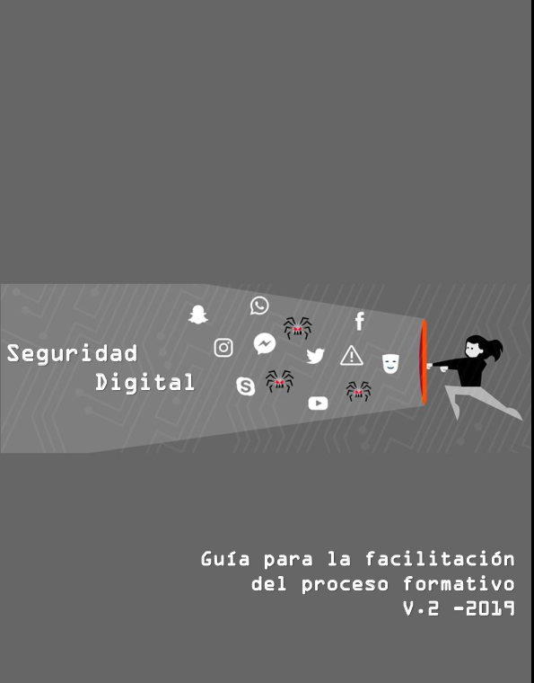

Este recurso se ha creado en el marco del Proyecto de Escuela de Seguridad Digital para la implementación del proceso de acompañamiento en Seguridad Digital dirigido a organizaciones de la sociedad civil, defensores de derechos humanos, activistas, comunidad LGBT, ambientalistas y periodistas, entre otras. Este proyecto es apoyado por eQualit.ie y coordinado por Colnodo.

El objetivo de esta guía es orientar a los facilitadores y facilitadoras respecto al diseño estructural, los lineamientos metodológicos y el plan de contenidos propio del proceso formativo de alfabetización en Seguridad Digital. Esta guía incluye juegos, materiales gráficos y audiovisuales, además de pautas y lineamientos para apoyar a los facilitadores y facilitadoras. Los temas podrán ser utilizados por separado o combinados para diseñar un taller completo, esta estructura temática modular permitirá a las personas formadoras seleccionar por medio de una evaluación preliminar secuencias (rutas) de temas y contenidos sugeridos que se ajusten a las necesidades de las personas participantes de la capacitación. Seguidamente, este documento presenta cada una de las temáticas de capacitación y recomendaciones para la formación, con descripciones detalladas de las actividades a desarrollar las cuales están orientadas a promover habilidades y prácticas relevantes que puedan aplicarse dentro de las organizaciones y ayuden a mitigar las vulnerabilidades en cuanto al manejo de información física y digital. 

En suma, esta currícula tiene el propósito de promover en las personas participantes el uso de herramientas y buenas prácticas para el manejo seguro de la información, de modo que puedan aplicar estos aprendizajes en sus organizaciones y en su vida cotidiana, haciendo de la seguridad digital una práctica diaria para la protección de su privacidad y la de las personas a quienes impacta su trabajo. 

